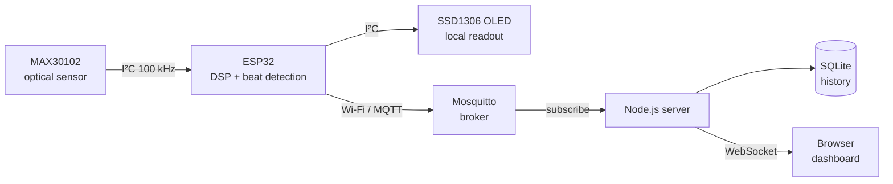
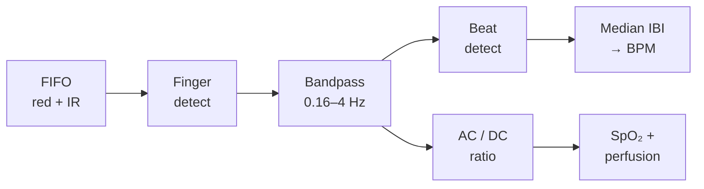

# IoT Vitals — Wireless Pulse Oximetry Dashboard

A networked photoplethysmography (PPG) system built on the ESP32. A fingertip
sensor node measures heart rate, SpO₂, perfusion and beat-to-beat intervals,
streams them over MQTT, and a local Node.js server stores the history and
drives a live browser dashboard.

**Local-first:** acquisition, processing, storage and presentation all run on
your own network. No cloud service sits in the path.

> [!WARNING]
> **This is not a medical device.** The MAX30102 is a hobbyist optical sensor
> and its readings are uncalibrated. Use this project to learn about
> photoplethysmography. Do not use it to make health decisions.

📄 The full project report is in [`IoT-Vitals-Report.pdf`](IoT-Vitals-Report.pdf).

---

## Contents

- [Features](#features)
- [Architecture](#architecture)
- [Repository layout](#repository-layout)
- [Hardware](#hardware)
- [Quick start](#quick-start)
- [Setup](#setup)
- [How it works](#how-it-works)
- [MQTT contract](#mqtt-contract)
- [Server and API](#server-and-api)
- [Web dashboard](#web-dashboard)
- [Heart rate variability](#heart-rate-variability)
- [Results](#results)
- [Tech stack](#tech-stack)
- [Troubleshooting](#troubleshooting)
- [Limitations and future work](#limitations-and-future-work)

---

## Features

- **On-device signal processing:** heart rate, SpO₂ and perfusion index are
  computed on the ESP32, so the node works on its own.
- **Local OLED readout:** a 0.91″ SSD1306 shows readings at the node, even
  without a network.
- **MQTT transport:** lightweight publish-subscribe with a last-will "offline"
  status, so the dashboard knows when a node disappears.
- **Persistent history:** SQLite storage with server-side downsampling from
  5 minutes up to 24 hours.
- **Live dashboard:** WebSocket updates, a PPG waveform, trends, HRV metrics
  and a Poincaré plot, with no build step.
- **Honest numbers:** readings are withheld rather than guessed when the signal
  can't support them.
- **Simulator included:** develop the server and dashboard with no hardware
  attached.

## Architecture

The system is a four-stage pipeline: optical acquisition, on-device signal
processing, wireless transport, and server-side storage with browser
presentation.



Each stage connects to the next through a defined interface, so any one can be
replaced without touching the others. The MQTT topic contract is the key
boundary: the server does not know how readings were produced, and the
firmware does not know who consumes them.

| Stage | Runs on | Responsibility |
|-------|---------|----------------|
| Acquisition | MAX30102 | 18-bit red and IR samples at 100 Hz |
| Processing | ESP32 | Bandpass filtering, beat detection, SpO₂, perfusion |
| Transport | Wi-Fi + MQTT | JSON payloads on per-device topics |
| Ingest and storage | Node.js + SQLite | Validation, persistence, HRV computation |
| Presentation | Browser | Live charts over WebSocket, history over REST |

## Repository layout

```
iot-vitals/
├── firmware/            ESP32 firmware (C++ / Arduino, PlatformIO)
│   ├── include/         secrets.example.h → copy to secrets.h
│   └── src/             main, vitals (DSP), net (Wi-Fi/MQTT), display (OLED)
├── broker/config/       Mosquitto configuration
├── server/              Node.js ingest, SQLite history, REST + WebSocket
├── web/                 Dashboard: plain ES modules, Canvas 2D
├── tools/               simulate.js (fake node), wifi-probe.sh
├── docker-compose.yml   Mosquitto broker
├── start.sh             One script to run the whole stack
└── IoT-Vitals-Report.pdf
```

## Hardware

| Component | Specification | Role |
|-----------|---------------|------|
| ESP32 DevKit V1 | ESP32-D0WD-V3, dual-core Xtensa LX6 @ 240 MHz, 320 KB SRAM, 4 MB flash, Wi-Fi + BLE | Sampling, signal processing, MQTT client |
| MH-ET LIVE MAX30102 | Integrated pulse oximeter, red 660 nm + IR 880 nm LEDs, 18-bit ADC, I²C `0x57` | Optical acquisition of the PPG |
| SSD1306 OLED | 0.91″, 128 × 32 monochrome, I²C `0x3C` | Local readout at the node |
| CH343 USB-serial *(on-board)* | Enumerates as a CDC-ACM device | Firmware upload and serial diagnostics |
| AMS1117-3.3 *(on-board)* | ~1 A regulator | 3.3 V rail from USB 5 V |

**Why these parts?** The MAX30102 packages both LEDs, a photodiode, the analog
front end and an 18-bit ADC together, so the microcontroller receives digital
samples over I²C instead of raw analog signals that need amplification. The
ESP32 has Wi-Fi built in and plenty of headroom for on-device filtering.

### Wiring

Both peripherals share one I²C bus. They are told apart by address, not by
wiring.

| Signal | ESP32 DevKit V1 | XIAO ESP32C3 | MAX30102 | SSD1306 OLED |
|--------|-----------------|--------------|----------|--------------|
| Power | `3V3` | `3V3` | `VIN` | `VCC` |
| Ground | `GND` | `GND` | `GND` | `GND` |
| I²C data | `GPIO21` | `D4` (GPIO6) | `SDA` | `SDA` |
| I²C clock | `GPIO22` | `D5` (GPIO7) | `SCL` | `SCL` |

- **Use 3.3 V, not 5 V.** Both modules have on-board regulation and level
  shifting, and the ESP32's GPIO pins are not 5 V tolerant.
- **No extra pull-up resistors are needed.** The MAX30102 breakout already has
  them.
- **The bus runs at 100 kHz** rather than 400 kHz fast mode. The lower rate
  leaves margin for the capacitance of jumper leads.
- **Addresses don't collide:** `0x57` for the sensor, `0x3C` for the display.
  The firmware scans the bus at boot and reports what it finds.
- Leave the MAX30102's `INT`, `RD` and `IRD` pins unconnected.

### Supported boards

| Board | PlatformIO env | Notes |
|-------|----------------|-------|
| ESP32 DevKit V1 | `esp32dev` | **Default.** |
| Seeed XIAO ESP32C3 | `seeed_xiao_esp32c3` | Native USB serial. |
| Seeed XIAO ESP32C3 | `seeed_xiao_esp32c3_nonet` | Sensor only, no Wi-Fi/MQTT. Use it to bring up a board that resets when the radio starts. |
| Either | `esp32dev_probe` / `wifi_probe` | Radio-only power probe. No sensor or credentials needed. |

## Quick start

```bash
./start.sh            # start broker + server, open the dashboard, tail the log
./start.sh -d         # same, detached
./start.sh status     # what is running, and what each node reports
./start.sh stop       # stop the server and the broker
./start.sh flash      # build and upload the firmware
./start.sh monitor    # serial monitor
./start.sh logs       # follow the server log
```

You can run `start.sh` more than once safely: it reports what is already
running instead of starting duplicates. On first use it installs the server
dependencies, and it prints the broker's LAN address. The firmware needs that
address as `MQTT_HOST`.

The dashboard is served at **http://localhost:3000**.

## Setup

**Requirements:** Docker, Node.js 24 (for the built-in `node:sqlite`), and
[PlatformIO](https://platformio.org/) for the firmware.

### 1. Broker

```bash
docker compose up -d
```

This runs Eclipse Mosquitto 2 on port 1883 with anonymous access, which is fine
on a trusted LAN. To add a password, follow the three steps in
[`broker/config/mosquitto.conf`](broker/config/mosquitto.conf).

### 2. Server and dashboard

```bash
cd server
npm install
npm start          # http://localhost:3000
```

The server has only two dependencies, `mqtt` and `ws`, and nothing to compile.
Configuration is optional: copy `.env.example` to `.env` to change the port,
the broker URL, or how many days of history are kept (default 7).

### 3. Firmware

```bash
cd firmware
cp include/secrets.example.h include/secrets.h
$EDITOR include/secrets.h        # Wi-Fi, broker IP, device id
pio run -t upload                # add -e seeed_xiao_esp32c3 for the XIAO
pio device monitor
```

`secrets.h` is gitignored. It holds the Wi-Fi SSID and password, the broker
address and port, and a `DEVICE_ID` that becomes the MQTT topic prefix.

> [!IMPORTANT]
> `MQTT_HOST` must be the **LAN address** of the machine running the broker
> (`hostname -I`), not `localhost`. The ESP32 reaches the broker over the
> network.

If `pio` isn't on your `PATH`, call `~/.platformio/penv/bin/pio` directly, or add it:

```bash
echo 'export PATH="$HOME/.platformio/penv/bin:$PATH"' >> ~/.bashrc
```

### No hardware yet?

The simulator publishes the same messages as the firmware:

```bash
node tools/simulate.js                       # a healthy finger on the sensor
node tools/simulate.js sim-02 --no-finger    # an idle node
```

Run several at once with different ids, and the dashboard adds a device picker.

## How it works

The firmware is C++ on the Arduino framework, built with PlatformIO. All signal
processing happens on the ESP32. The server receives derived values, not raw
samples.

### Sensor configuration

| Parameter | Value | Reason |
|-----------|-------|--------|
| LED mode | Red + IR | SpO₂ needs two wavelengths |
| Sample rate | 400 Hz, averaged × 4 | Gives an effective 100 Hz stream |
| Pulse width | 411 µs | Enables full 18-bit ADC resolution |
| LED amplitude | `0x3C` | Balances signal strength against saturation |
| ADC range | 16384 | A fingertip saturates the narrower 4096 range and clips the whole pulse |

### Processing chain



**Finger detection.** A fingertip raises the IR DC level from roughly 250
counts to tens of thousands. Crossing a 12,000-count threshold counts as
contact. Below it, every derived value is cleared rather than left stale.

**Cardiac bandpass.** A fast exponential moving average (τ ≈ 0.25 s) minus a
slow one (τ ≈ 1 s) keeps the 0.16–4 Hz band where a pulse lives. Measuring
amplitude on the unfiltered signal would add all the out-of-band noise and bias
SpO₂ low.

**Beat detection.** Peaks are found on the infrared channel. Intervals outside
300–2000 ms (30–200 bpm) are rejected as artefacts. The rate comes from the
**median** of the last eight intervals, because one missed beat doubles an
interval and would drag a mean down by roughly 10 bpm. The median stays put.
Heart rate is reported only after 3 beats have been accepted.

**Oxygen saturation.** Oxygenated and deoxygenated haemoglobin absorb 660 nm
and 880 nm light differently. The ratio of pulsatile (AC) to steady (DC)
absorption at the two wavelengths therefore tracks saturation:

```math
R = \frac{AC_{red} / DC_{red}}{AC_{IR} / DC_{IR}}
\qquad
SpO_2 = -45.060\,R^2 + 30.354\,R + 94.845
```

AC is the RMS of the bandpassed signal over a 4-second window. DC is the mean
over the same window. The polynomial is Maxim's empirical curve for this sensor
family: fine for trends, but not calibrated against a reference. Estimates go
through a median filter, then an exponential moving average, so the readout
changes gradually.

**Perfusion index** is peak-to-peak IR AC over DC, × 100, which is what
commercial oximeters display. It is the best single measure of signal quality.

**Quality gating.** The firmware withholds SpO₂ rather than publish a
plausible-looking but meaningless number when any of these is true:

- the ADC is saturated;
- perfusion is below 0.15 %;
- the pulse amplitude jumps more than 60 % against its running average, or
  perfusion goes above 8 %.

The last condition means the finger is moving. Motion changes both wavelengths
almost equally, which drives R toward 1. The polynomial turns that into a
confident but false reading near 80 %.

## MQTT contract

All topics are namespaced per device as `vitals/<device-id>/<channel>`.

| Topic | Rate | Payload |
|-------|------|---------|
| `…/vitals` | 1 Hz | `{t, bpm, spo2, pi, finger, ir, rdc, rssi, up}` |
| `…/ppg` | 2 Hz | `{t, fs, ppg: [25 × int16]}`: baseline-removed IR at 50 Hz |
| `…/ibi` | per beat | `{t, ibi: [ms, …]}`: intervals between accepted beats |
| `…/status` | on change | `online` / `offline` (plain text, retained) |

Design decisions:

- **Last will and testament.** The node registers `offline` as its MQTT will
  when it connects. If it loses power or drops off the network, the broker
  publishes `offline` for it, so the dashboard shows the node as disconnected
  instead of freezing on its last reading.
- **Retained status.** A dashboard opened later learns the device state
  immediately.
- **Waveform batching.** Samples are sent 25 at a time, twice a second, rather
  than 50 separate messages per second.
- **Beats are published individually, not averaged.** HRV is defined by the
  spacing between beats, so averaging before transmission would destroy the
  quantity being measured.
- **Device time is not trusted.** `t` is milliseconds since boot. The server
  timestamps everything when it arrives and keeps `up` only as an uptime
  readout.

## Server and API

The server is a Node.js application with two runtime dependencies (`mqtt` and
`ws`). It uses Node's built-in `node:sqlite`, so no native driver needs
compiling. It:

1. subscribes to `vitals/+/+` and validates incoming JSON;
2. stamps every reading with server time;
3. stores readings and individual heartbeats in SQLite;
4. keeps recent waveform samples and beat intervals in memory;
5. computes HRV metrics on each new beat;
6. sends updates to connected browsers over WebSocket;
7. serves the dashboard and a small REST API.

```sql
CREATE TABLE readings (
  id     INTEGER PRIMARY KEY,
  device TEXT    NOT NULL,
  ts     INTEGER NOT NULL,   -- server epoch ms
  bpm    REAL,
  spo2   REAL,
  pi     REAL,
  rssi   INTEGER
);

CREATE TABLE beats (
  id     INTEGER PRIMARY KEY,
  device TEXT    NOT NULL,
  ts     INTEGER NOT NULL,
  rr     INTEGER NOT NULL    -- interval to previous beat, ms
);
```

Write-ahead logging is enabled, so reads never block ingest. Readings are
stored **only while a finger is detected**, so charts show real measurement
sessions rather than long runs of zeros. History queries are grouped into time
buckets on the server, so a 24-hour range returns a few hundred points instead
of 86,000 rows.

| Route | Returns |
|-------|---------|
| `GET /api/health` | Broker connection state, device and client counts |
| `GET /api/devices` | Live devices plus every device ever recorded |
| `GET /api/history?device=<id>&range=5m\|15m\|1h\|6h\|24h` | Bucketed averages |
| `GET /api/hrv?device=<id>&minutes=5` | HRV metrics and Poincaré pairs |
| `WS /ws` | A `snapshot` on connect, then `vitals` / `ppg` / `status` frames |

## Web dashboard

The dashboard is served as plain ES modules drawn on Canvas 2D, with no build
step or framework. It has three views, switched from a sidebar. Each view has
its own URL hash, so you can link to it.

| View | Contents |
|------|----------|
| **Live** | Heart-rate hero figure, signal-quality meter, SpO₂ and perfusion, PPG waveform |
| **Variability** | HRV metrics, Poincaré plot, beat-interval tachogram |
| **History** | Range selector, heart-rate and SpO₂ trends, table view |

Visualisation decisions:

- **Separate charts, never a dual axis.** Heart rate and SpO₂ have very
  different ranges. Two y-scales on one chart would suggest a correlation that
  isn't there.
- **Gaps are breaks, not slopes.** When no finger is present nothing is
  recorded, and the chart line breaks instead of joining across the gap.
- **The waveform is gated on contact.** Without a finger, auto-scaling would
  make sensor noise look like a signal. The panel shows a prompt instead.
- **Numbers are withheld when unsupported.** A tile shows a dash, not a zero,
  so "not measured" never looks like "measured as zero".
- **Colour accessibility.** Series colours were checked by script, including a
  colour-vision-deficiency separation check. Every chart also labels its latest
  value directly, and the table view shows the same numbers with no colour at
  all.

## Heart rate variability

HRV measures the spacing between individual beats rather than their average
rate. It reflects autonomic balance rather than cardiac output, so two people
with the same pulse can differ a lot.

| Metric | Definition |
|--------|------------|
| RMSSD | Root mean square of successive interval differences; the standard short-term measure |
| SDNN | Standard deviation of the intervals; longer-term variability |
| pNN50 | Share of consecutive pairs differing by more than 50 ms |
| SD1 | Poincaré spread perpendicular to the line of identity (= RMSSD / √2) |
| SD2 | Poincaré spread along the line of identity |

```math
\mathrm{RMSSD} = \sqrt{\frac{1}{N-1}\sum_{i=1}^{N-1}\left(RR_{i+1} - RR_i\right)^2}
```

**Artefact rejection.** RMSSD is a difference measure, so it is very sensitive
to the errors an optical sensor makes: a missed beat doubles an interval and a
double-counted beat halves it. Before any metric is computed, intervals more
than 20 % from the running median are rejected. The dashboard shows how many
were rejected, so a noisy recording is visibly noisy. No metric is reported
below 20 clean beats.

**Poincaré plot.** Each interval is plotted against the next. The shape tells
the story. A tight cluster on the diagonal means low variability, and a wide
cloud means high variability. Ectopic beats appear as separate points off the
diagonal, which no single summary number would reveal. Both axes share one
scale so the shape isn't distorted. An SD1/SD2 ellipse is drawn over the
points.

## Results

Measured from a fingertip on the finished hardware:

| Quantity | Measured | Notes |
|----------|----------|-------|
| Heart rate | 72–89 bpm resting | Stable to within a few bpm over a held window |
| SpO₂ | 98.0 % (range 95.3–99.7) | Plausible for a healthy subject |
| Perfusion index | 0.83–4.79 % | Above the 0.15 % floor needed for a valid ratio |
| IR DC level | ~65,000 counts | About 25 % of full scale: good headroom, no clipping |
| Dark baseline | 245–590 counts | The expected value with no finger |
| RSSI | −59 to −66 dBm | Reliable link throughout |

| System measure | Value |
|----------------|-------|
| Firmware SRAM usage | 16.2 % of 320 KB |
| Firmware flash usage | 60.4 % of 1.31 MB |
| Effective sample rate | 100 Hz |
| Vitals publish rate | 1 Hz |
| Waveform publish rate | 2 Hz (25 samples per message) |
| Server dependencies | 2 (`mqtt`, `ws`) |

Heart rate was the most robust output. SpO₂ only became trustworthy after the
bandpass and motion gating were added. HRV is the most demanding, because it
depends on detecting every single beat correctly.

## Tech stack

| Layer | Technology |
|-------|------------|
| Firmware | C++ / Arduino framework, PlatformIO |
| Sensor driver | SparkFun MAX3010x library |
| Display driver | Adafruit SSD1306 + GFX |
| MQTT client (device) | PubSubClient |
| Broker | Eclipse Mosquitto 2, in Docker |
| Server | Node.js 24 (`mqtt`, `ws`, built-in `node:sqlite`) |
| Dashboard | Plain ES modules, Canvas 2D, no build step |

## Troubleshooting

**`[max30102] not found` on boot.** The firmware runs an I²C scan first, so
look in the serial monitor for `device at 0x57`. If nothing is found at all,
SDA and SCL are usually swapped, or the module is on 5 V without a shared
ground.

**Board doesn't appear as a serial port.** Hold `BOOT`, tap `RESET`, then
release `BOOT` to force the bootloader. On Linux, make sure your user is in the
`dialout` group.

**Board reboots as soon as Wi-Fi starts.** Enabling the radio draws a
300–400 mA step, and a weak 3.3 V rail sags under it. Try the
`seeed_xiao_esp32c3_nonet` or `*_probe` envs to tell a power problem from a
sensor problem.

**Dashboard says "device offline".** Check `docker compose logs mosquitto`, and
confirm that `MQTT_HOST` in `secrets.h` is the broker machine's LAN IP.

**Readings jump around.** Cover the sensor fully, rest your hand on the table,
and watch the perfusion index. Press lightly, because pressing hard squeezes
the blood out of the capillaries being measured.

## Limitations and future work

### Limitations

- **Not a medical device.** The SpO₂ polynomial is an empirical curve for this
  sensor family, not a calibration against a reference oximeter.
- **Motion sensitivity.** Motion windows are detected and rejected, so you get
  fewer valid readings during movement, not correct ones.
- **Contact dependence.** Perfusion varies with pressure and skin temperature.
- **HRV needs clean beats.** A recording with many rejected intervals should be
  treated as indicative only.
- **Single-node testing.** Topics and the dashboard support multiple devices,
  but only one node has been built and tested.

### Future work

1. **Calibrate SpO₂** against a reference oximeter, using paired measurements
   to fit coefficients for this sensor.
2. **Derive respiration rate** from the PPG. Breathing modulates amplitude,
   beat timing and baseline, so bandpassing the interval series at 0.1–0.5 Hz
   could give a second vital sign from the same sensor.
3. **Battery operation** with deep sleep between sessions.
4. **Multiple nodes** for simultaneous subjects. The topic namespacing already
   supports this.
5. **Guided breathing biofeedback:** pace breathing at about six breaths per
   minute on the OLED while showing HRV live.
6. **Session recording and CSV export** for offline analysis.
